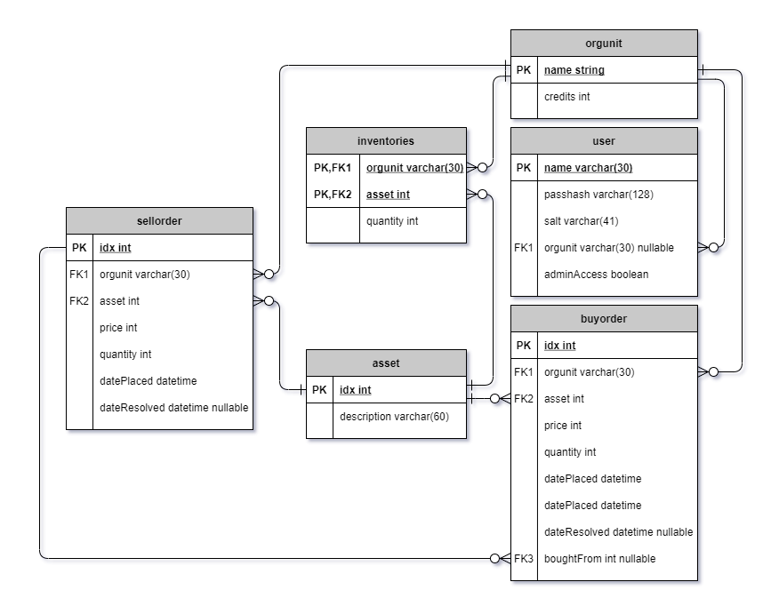
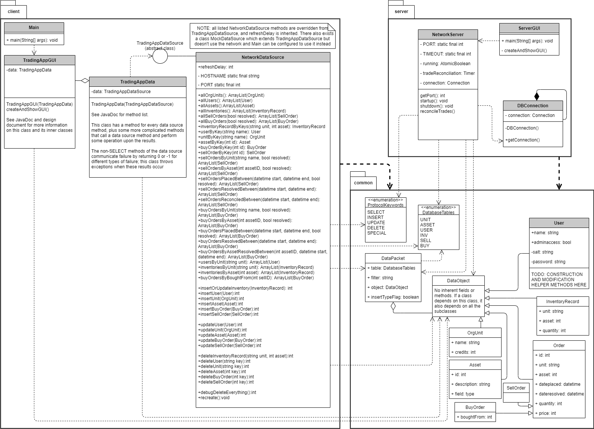
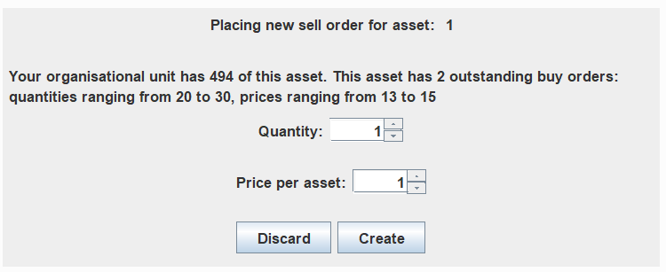
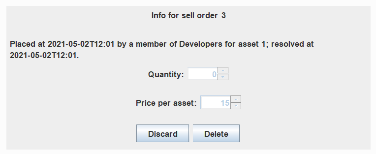
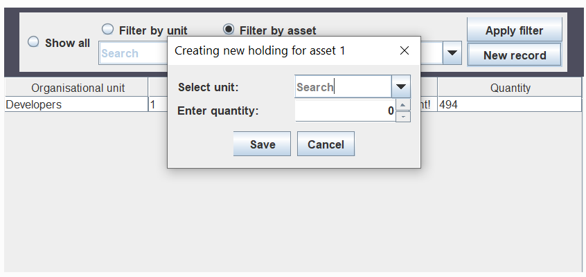

# Requirements
This project should consist of two programs that can be built and run separately.

----
## Server-side core functionality
Requirements that apply to the server-side program

| Requirement                 | Descriptions         | Priority   |
| :---                        | :---                 | :---:      |
| Store user information      | System stores user information: unique username, password, account type, organisational unit membership | Must have |
| Store organisational unit info | System stores information on organisational units: name, credit balance  | Must have |
| Store asset info | System stores information on asset types | Must have |
| Store inventories | System stores information on the assets held by each organisational unit | Must have |
| Store outstanding trade info | System stores information on buy and sell orders: who placed it, asset, quantity, price, date placed | Must have  |
| Store executed trade info | System stores all of the above information for resolved buy and sell orders, plus date resolved and information on which buy-sell pairs formed transactions | Must have  |
| Process client requests | Server program listens for client program requests to retrieve or modify data and sends back appropriate results | Must have | 
| Automatic trade resolution | System frequently checks to match BUY/SELL orders | Must have  |
| BUY/SELL restrictions | System only resolves trades where buy quantity <= sell quantity and buy price >= sell price | Must have  |
| Executing trades | When trades are resolved, the credits and holdings of the organisational units involved are correctly updated, using the buy quantity and the sell price | Must have |
| continued | If a transaction does not reduce a sell order's quantity to 0, the order will remain outstanding. If the prices were different, the difference will be returned to the buyer | Must have |
| Network connection | Communication between the server and client programs happens via a network socket | Should have |
| Database | System stores information in a SQL Database which persists between sessions | Should have |
| Read config file | System reads config file to get port number | Could have |

Note that the "should have" requirements almost qualify for "must have". However, most of the absolute must-haves can
be imitated by a system that does not utilise a real database or network connection. A mock database structure,
implemented early on to stand in for the server connection, remains present even in the final program to allow the client program
to be tested without having the server active, and the client program can be configured to use it.

These requirements have guided the development of a MariaDB database with tables and relations described by the following
Entity Relationship Diagram.

Every five minutes, the server program will automatically run some queries to determine if any trade resolution is necessary,
and resolve the trades if so. Older buy and sell orders will be prioritised over newer ones.

## Client-side core functionality
Requirements that are needed for the Client-side to be functional.

### Program components
| Requirement               | Description                                                   | Priority   |
| :---                      | :---                                                          | :---:      |
| Order placing checks | The total price of a buy order, and quantity of a sell order, shouldn't be allowed to exceed the unit's available credits/holding of the asset | Must have |
| Password hashing | Passwords are hashed so plaintext passwords are never sent | Should have |
| Graphical User Interface  | A more user friendly UI instead of the terminal               | Could have |
| Generate visual graph     | A (stock-like) graph showing an asset's value fluctuating     | Could have |
| Trade executed alert      | Push an alert to online members of that organisational unit   | Could have |
| Client to read config file| Changes the Client's server IP address and port to connect to   |     Could have|

These requirements will be enforced on the client side of the client-server communication

### Admin abilities

| Requirement               | Description                                                   | Priority   |
| :---                      | :---                                                          | :---:      |
| Create usernames           | As an IT admin I want to create unique usernames                 | Must have  |
| Generate passwords         | As an IT admin I want to generate passwords for users            | Must have  |
| Assign account type        | As an IT admin I want to specify each account's level of access  | Must have  |
| Assign user to unit        | As an IT admin I want to assign users to a unit                  | Must have  |
| Credit system              | As an IT admin I want to edit the budget assigned to a unit       | Must have  |
| Create new asset types     | As an IT admin I want to add any asset type                      | Must have  |    
| Edit assets     | As an IT admin I want to edit asset descriptions               | Should have  |    
| Create organisational unit | As an IT admin I want to create new organisational units  | Must have  |
| Edit inventories | As an IT admin I want to modify the asset quantities held by units  | Must have  |

### User abilities

| Requirement               | Description                                                   | Priority   |
| :---                      | :---                                                          | :---:      |
| Set SELL order            | As a user I want to sell assets by setting quantity & price   | Must have  |
| Set BUY order             | As a user I want to buy assets by setting quantity & price    | Must have  |
| Cancel an order           | As a user I want to cancel outstanding orders from my unit    | Must have  |
| Request current orders    | As a user I want to view my unit's outstanding orders         | Must have  |
| Request available inventory| As a user I want to view my unit's asset holdings      | Must have  |
| Request available credits | As a user I want to view my unit's available credits          | Must have  |
| Request average BUY/SELL  | As a user I want to view an asset's current average price     | Should have|
| Password Self Service     | As a user I want to be able to change my own passwords        | Should have |

----

## GUI ideas
- Users to receive a message upon fulfilment of an order.
- Current orders graph 

- Historical trades Graph

## Additional Documentation
### Configuration File
The configuration file for the application is to contain the IP address and Port Number of the server that the application is hosted on.
Additionally, the configuration file for the Server is to also contain these details.

# Detailed Design Document
____

## Common package
There are also some custom exceptions but none of them do anything very non-straightforward

[Go to JavaDoc](../doc/common/package-summary.html)

### DataObjectFactory
This class was introduced very late in the game to be the factory pattern for all DataObject subclasses. I ran out of
time before I could finish it.

Basically the idea is that it covers validation for data objects so that exceptions are only checked for when necessary.

[Go to JavaDoc](../doc/common/DataObjectFactory.html)

### DataObject
This class's reason for existence is to serve as a shared superclass for all the classes representing database records
so that the serialised `ArrayList`s that result from a SELECT query would be of a more specific type than `Object`.

It has no fields or methods; the only thing of note about it is that it `implements Serializable`.

### User
This DataObject subclass represents a record in the `User` table. Its non-static fields are the following (all private
with public getters):
* username (has no public setter)
* hashed password (has non-straightforward public setter)
* salt string (has no public setter)
* org unit name (has straightforward public setter)
* admin access boolean (has straightforward public setter)

The class also owns a private string constant defining the available characters for salt string generation.

The class has two constructors: the client-side constructor, and server-side constructor.

The server-side constructor has parameters for all five fields and straightforwardly assigns the values.

The client-side constructor has this signature:
`public User(String username, String password, boolean adminAccess, String orgunit) throws InvalidString`
Its algorithm is non-straightforward in two main ways.
* Rather than naively assigning `this.username=username`, it checks that the username consists entirely of letters and 0<length<=30.
  If this is not true, it throws InvalidString; if it is, the username is converted to lowercase and assigned to the field
* Its password parameter is non-hashed. It generates a salt string using a private method and assigns it to the
  salt string field, then calls `hashPassword(password, this.salt)` to get the hashed password. If the password hashing
  threw InvalidString, the exception is passed along the stack to be caught by the caller.

DESCRIPTIONS OF NON-STRAIGHTFORWARD PUBLIC METHODS

**public static String hashPassword(String password, String salt) throws InvalidString** 
*Method desc:* Hashes password string using salt string and returns the result; throws InvalidString if password string
contained any whitespace

**public boolean changePassword(String newPassword) throws IllegalString** 
*Method desc:* Calls `hashPassword(newPassword, this.salt)` and assigns the value to the password field.
If hashPassword threw an exception, the password change is aborted, and the exception is passed to the caller.

### OrgUnit
This DataObject subclass represents a record in the `orgunit` table. Its fields (private with public getters) are:
* name (no setter)
* credits int (public setter)

The class has no methods other than accessors and mutators.

NAME LENGTH RESTRICTION, CREDITS POSITIVE RESTRICTION

### Asset
This DataObject subclass represents a record in the `Asset` table. Its fields (private with public getters) are:
* id (no setter)
* description (no setter)

### InventoryRecord
This DataObject subclass represents a record in the ``

### Order
This DataObject subclass contains fields for all properties shared by both buy and sell orders.
These (all private with public getters and setters) are:
* id (int)
* unit (String)
* asset (int)

### SellOrder
This class represents a record in the `SellOrder` table. Its direct superclass is `Order`.
It has no fields or methods beyond those in its superclass.

### BuyOrder
This DataObject subclass represents a record in the `BuyOrder` table. Its direct superclass is `Order`.
It has one field beyond its superclass: `boughtFrom`, a nullable Integer which is private with public getter.
A public setter is not needed because trade resolution happens server-side.

### DataPacket
This serializable class is used in the protocol to contain all information about a query other than its type.

### Enums
#### DatabaseTables
This enum has values for each database table. Each one has a table name string and column name string array.
All references to table or column names are computed using this enum, including the create script, so renaming
a table or column is trivial by just changing the value in this enum, then dropping and recreating tables.
#### ProtocolKeywords
A value of this enum is always the first transmission by the client in a request.
It has values for SELECT, INSERT, UPDATE, DELETE and also SPECIAL which is used for all other necessary requests

## Protocol

The protocol connecting the server and client programs works like this:
* The sockets used are governed by the PORT final variables in NetworkServer and NetworkDataSource
* The server is expected to run on the address specified in NetworkDataSource.HOSTNAME
* The server is always listening on the socket
* The client sends requests in the form of a ProtocolKeywords value then a DataPacket containing info constructed thusly (all fields not mentioned in a given type are null):
    - For a SELECT or DELETE query, the table field contains the relevant table name,
      and the filter field contains a string containing the desired query's WHERE clause
    - For an UPDATE query,  the table field contains the relevant table name,
      and the object field contains the DataObject whose data should be written to the table
      if and only if a record with its primary key currently exists
    - For an INSERT query, the table field contains the relevant table name,
      the object field contains the DataObject to insert, and the insertTypeFlag
      field is set to true if the query should be "INSERT UPDATE IF DUPLICATE KEY", false otherwise
    - For a special debug request, the filter field contains one of the string constants specified in ProtocolKeywords
      to determine which special request type to do: drop all tables, rerun create table script, or get time until reconciliation
* The server runs the desired query and sends back one of two types of feedback:
    - For a SELECT query, an `ArrayList<DataObject>` of the results, sorted by primary key value ascending
      (for Inventories, primary order by orgunit and secondary by asset)
    - For any other kind of query, an integer value encoding the effect of the query
        - A positive number means "this many rows were affected". For queries executed via the connection,
          queries that fall under "DELETE with a PK-value filter, INSERT with the flag set false, or UPDATE"
          will never exceed 0. If the query was INSERT with flag true, 2 means "the INSERT failed but the UPDATE succeeded".
          A special request of the type "drop all tables" will return the total number of records erased by the drop.
        - 0 means "query benignly failed" (UPDATE where PK value does not exist, INSERT where PK
          value already exists, DELETE where the filter matched no records)
        - -1 means "query failed due to a foreign key constraint". I.e. the query was an INSERT or UPDATE where a FK value
          was not a valid reference to any parent table record

## Server program

[Go to JavaDoc](../doc/ServerSide/package-summary.html)

### ServerGUI

[Go to JavaDoc](../doc/ServerSide/ServerGUI.html)

*Class desc:* Where the server-side program starts running.
Has a basic GUI for debug purposes. This GUI contains a label specifying the port, a label with the datetime
of the most recent trade resolution, and a button that shuts down the server.
It also has three more buttons for debug purposes: one which invokes trade resolution, one which drops all database tables,
and one which re-runs the table creation script

**main()** 
*Method desc:* Initialises the server-side GUI and starts up the server.

### NetworkServer
This class is the back end of the server side. It deals with information sent over the connection as dictated by
the protocol, and also automatically resolves trades every 5 minutes using a timer thread.

None of this class's members are public, because they don't need to be accessed outside the package.
It has string constants for useful queries.

[Go to JavaDoc](../doc/ServerSide/NetworkServer.html)

Here is the logic followed by trade reconciliation. Note that the selling unit's inventory of the sold asset and the
buying unit's credit balance were reduced by the appropriate amounts when the orders were placed, so no reduction
of balance or inventory takes place at resolution time, and transactions with a price difference result in
the buying unit being refunded the difference. Example: Unit 1 places a buy order for 10 widgets at 6 credits each. 50
credits are deducted from the unit's balance at time of order placement. Unit 2 places a sell order offering 10 widgets
at 4 credits each; 10 widgets are deducted from the unit's inventory. Those two orders are then resolved in trade reconciliation.
Unit 2 gains 30 credits; Unit 1 gains 10 widgets and 20 credits because there was a total price difference of 20.

* Save the current date and time in `now`. This timestamp will be used for all orders resolved in this session.
* Declare tracking variables used to display information about the resolution session
* For each asset in the database:
    * Save the asset ID in `asset`
    * Retrieve the list of all sell orders (ordered from oldest to newest), and the list of all buy orders
      (also ordered from oldest to newest).
    * Define local int collection `ignoredBuys` as empty. This collection contains the IDs of all buy orders
      that were resolved earlier in the session; this way, we only need to query the table for outstanding buys
      at the start of each asset rather than at the start of each sell order
    * For each sell order in the list:
        * Save the order's quantity in local variable `sellQty`. (for readability my program also saves the order's
          other properties in `sellID`, `sellPrice` and `sellUnit`, but the quantity is the only one which NEEDS a
          variable, so that the quantity for comparison accurately reflects)
        * Iterate over the asset's list of buy orders from the start.
        * For each buy order:
            * For readability, my program saves its properties in `buyID`, `buyPrice`, `buyQty`, `buyUnit`
            * Check if the order's ID is referenced in `ignoredBuys`. If so, move on to the next one
            * If `buyPrice >= sellPrice && buyQty <= sellQty`:
                * The transaction can be resolved!
                * Reduce `sellQty` by `buyQty`
                * Add `buyID` to `ignoredBuys`
                * Update the buyorder record via the updatable resultset: set the price, dateResolved and boughtFrom columns
                  to `sellPrice`, `now`, and `sellID` (the price is changed because buy orders are used to represent
                  transactions, so resolved buy orders should store the price at which the sale actually happened)
                * Update the sellorder record via the updatable resultset: set the quantity column to the new value of
                  `sellQty`, and if `sellQty` now equals zero, set dateResolved to `now` (if not, leave it null)
                * Execute an UPDATE on orgunit: increase the credits of `sellUnit` by `sellPrice * buyQty`
                * If the prices were different, execute another UPDATE on orgunit: increase the credits of
                  `buyUnit` by `(buyPrice-sellPrice)*buyQty`
                * Execute a special INSERT ON DUPLICATE KEY UPDATE on Inventories: attempt to insert an inventory record
                  for `buyUnit` and `asset` with quantity `buyQty`; if a record for this unit-asset combo
                  already exists, instead increase the current value by `buyQty`
                * Commit the database connection now that all the queries have executed successfully;
                  there is a try/catch around this whole thing that does a rollback if a SQLException occurs
                * Update tracking variables

### Database
For this assignment a MariaDB database will be used to store six tables of data:
- [User](#user-table)
- [OrgUnit](#orgunit-table)
- [Inventories](#inventories-table)
- [Asset](#asset-table)
- [BuyOrder](#buyorder-table)
- [SellOrder](#sellorder-table)

The relationships between these tables can be seen in the below ERD diagram.

The line types encode this information about the relations in the database:
- All relations are 1-M (a PK value may have arbitrarily many FK references)
- All relations are optional (a PK value may have 0 FK references),
  but all FK columns except for boughtFrom and user.orgUnit are `NOT NULL`

### User Table
This table is used to store user data. It has four columns:
- name (string, PK)
- passhash (string)
- saltString (string)
- orgUnit (string, FK referencing orgUnit.name, ON DELETE SET NULL)
- adminAccess (boolean)

The password is stored as a hash, made using the salt string, so that plaintext
passwords are never sent between the client and server programs.
Ideally, the salt string would be stored in a separate table, but this
project's scope is too small for this to be worthwhile.

### OrgUnit Table
This table is used to store all the organisational units that use the app, and
their credit balance. It has two columns:
- name (string, PK)
- credits (int)

### Asset Table
This table is used to store the assets that can be traded in the application.
It has two columns:
- idx (int)
- description (String)

### Inventories Table
This table stores information about the quantities of assets owned
by OrgUnits. Because "OrgUnit owns asset" is a logical many-many relationship,
this table has a composite key: an organisational unit name, and an asset ID, may
each appear arbitrarily many times, but only one record may exist for any
given OrgUnit-Asset pair. The table has three columns:
- orgUnit (string, partial key, FK referencing orgUnit.name, ON DELETE CASCADE)
- asset (int, partial key, FK referencing asset.idx, ON DELETE CASCADE)
- quantity (int)

### SellOrder Table
This table is used to track all the placed sell orders.
It has seven columns:
- idx (int, PK)
- unit (string, FK referencing orgunit.name, ON DELETE CASCADE)
- asset (int, FK referencing asset.idx, ON DELETE CASCADE)
- price (int)
- quantity (int)
- datePlaced (date)
- dateResolved (date, will be null if order is currently outstanding)

### BuyOrder Table
This table is used to track all the placed buy orders.
It has eight columns:
- idx (int, PK)
- unit (string, FK referencing orgunit.name, ON DELETE CASCADE)
- asset (int, FK referencing asset.idx, ON DELETE CASCADE)
- price (int)
- quantity (int)
- datePlaced (date)
- dateResolved (date, will be null if order is currently outstanding)
- boughtFrom (int, FK referencing sellOrder.idx, ON DELETE CASCADE)

The reason for this asymmetry is that the system will resolve matching
BuyOrders and SellOrders where the SellOrder has a higher quantity,
so it makes the most sense to model it like this.

## Client program
[Go to JavaDoc](../doc/ClientSide/package-summary.html)
### Main
[Go to JavaDoc](../doc/ClientSide/Main.html)

This is where client execution will start. For debug purposes, if run with an args array starting with "MOCK", the
mock database will be used instead of the real one, and if run with an args array ending with "TESTDATA", it will
populate a lot of test data (otherwise it will just populate one admin and one non-admin user).

### TradingAppGUI
[Go to JavaDoc](../doc/ClientSide/NewTradingAppGUI.html)

This is the GUI class. It is a Swing GUI implemented as a JFrame subclass, and has the following pages, implemented
using inner JPanel subclasses:

| Page | Image | Behaviour |
| :--- | :---                 | :---:      |
| Login page | | lets you log in. Menu bar (also present in rest of screenshots) has Logout, Exit, Change Password, Master User Key, Master Admin Key |
| Home page |  | Home page with your unit's assets (table blank if no unit). In shell panel top bar (present in rest of screenshots), "home" button goes to this page, "all assets" goes to asset list page, "orders" goes to order list page. Clciking on a row of the table takes you to asset info page for the asset. |
| Admin portal |  | Admin home accessible to only admins. As you can see a button to go to it is available if you are logged in as an admin. The dropdowns are GuiSearches of the appropriate tables; the buttons do what they suggest |
| Change password page |  | Page where a user can change their own password. Current password must be entered and it only accepts the change if the two lower fields match and are valid. |
| Asset info page | | Page for an asset. Buy and sell buttons take you to the order placing page. Buttons with time intervals are supposed to show a graph but this could not be implemented in time so they print the data instead. |
| Order list page | | Page showing a list of orders according to the specifications. Clicking a row takes you to the order details page in deleting mode, IF AND ONLY IF it is either true that the order is an outstanding order from your org unit or you are an admin |
| Order placing/viewing page | | This page is a form for orders. It has 4 types as seen. Clicking discard gives you the choice to go back to the order list or asset page. |
| Asset list page |  | Page with a list of all assets. Clicking on a row takes you to the asset's info page like in the home page |
| Unit editing page |  | Page to create or edit an organisational unit, only accessible via the admin portal. It has two versions as shown |
| User editing page |  | Page to create or edit a user, only accessible from admin portal. It has two versions as shown |
| Asset editing page |  | Page to create or edit an asset, only accessible from admin portal. It has two version as show |
| Inventory list/edit page |   | Page showing inventory holdings, only accessible from admin portal from either of the "holdings" buttons. When a row is clicked a dialog appears to edit quantity or delete. The "new record" button is only available when a valid filter is applied fore either unit or asset, and it opens a dialog as shown with the dropdown allowing any units (for asset) or assets (for unit) where there isn't already a record with the filter thing |

This is an old diagram of the GUI data flow. It is outdated but still has some useful information.

## GuiSearch
[Go to JavaDoc](../doc/ClientSide/GuiSearch.html)

This is a JComboBox subclass used for dropdowns in the GUI. I'm not entirely sure why we needed it,
but the boys implemented it before the group split and I assumed it was useful

### TradingAppData
This class mediates between the GUI and NetworkDataSource. The GUI owns an instance of this class, and this
class owns an instance of NetworkDataSource (or MockDataSource if the program was run with {"MOCK"}).

[Go to JavaDoc](../doc/ClientSide/TradingAppData.html)

### NetworkDataSource
This is the back end of the client program. It communicates with the server using the protocol. For debug purposes there also exists
the class "MockDataSource" which implements the same interface as this class and imitates its I/O behaviour
but uses a class of six Java collections to store data rather than the database.

[Go to JavaDoc](../doc/ClientSide/NetworkDataSource.html)

# Instructions for deployment
Before deploying, ensure you have MariaDB installed, and a database and SQL user matching those specified in `src/db.props`.
My MariaDB install was on a non-standard port due to a conflict with a pre-existing Postgres install, so you may need
to change the port specified in the file. Also ensure that, if you want to run the server
on a host other than localhost, that you update the host name constant in NetworkDataSource and
the port constants in NetworkDataSource and NetworkServer

No need to create tables; the server will run a series of CREATE TABLE IF NOT EXISTS statements on startup.
The client will automatically insert two users (an admin and a non-admin) on startup, which can be logged into via
the Dev Tools menu on the menu bar.

The continuous integration pipeline is broken, but the Ant build script runs correctly when run from intellij.
The `build` target produces two jar files ClientApp.jar and ServerApp.jar, which can be run from the command line.
These jar files are ready to run with java -jar in the command prompt. If you only
want to build one program, you can run just buildClient or just buildServer.

Command line argument options:
* If the client is run as `java -jar ClientApp.jar TESTDATA` it will populate a bunch of example data in the database.
  (Note that if you run this version twice without dropping and recreating the tables in between, strange things will happen)
* If the client is run as `java -jar ClientApp.jar MOCK` it will use a mock structure instead of needing the server.
  `MOCK TESTDATA` does what it sounds like.
* If the server is run as `java -jar ServerApp.jar RESET` all tables will be dropped and recreated 
