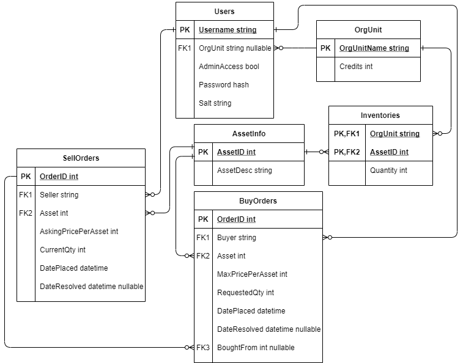

# Detailed Design Document
____

## Common package

###DataObject
This class's reason for existence is to serve as a shared superclass for all the classes representing database records
so that the serialised `ArrayList`s that result from a SELECT query would be of a more specific type than `Object`.

It has no fields or methods; the only thing of note about it is that it `implements Serializable`.

A possible improvement in future versions would be to refactor the creation of DataObject subclasses to involve the factory pattern.

###User
This DataObject subclass represents a record in the `User` table. Its non-static fields are the following (all private
with public getters):
* username (has no public setter)
* hashed password (has non-straightforward public setter)
* salt string (has no public setter)
* org unit name (has straightforward public setter)
* admin access boolean (has straightforward public setter)

The class also owns a private string constant defining the available characters for salt string generation.

The class has two constructors: the client-side constructor, and server-side constructor. 

The server-side constructor has parameters for all five fields and straightforwardly assigns the values. 

The client-side constructor has this signature: 
`public User(String username, String password, boolean adminAccess, String orgunit) throws InvalidString`
Its algorithm is non-straightforward in two main ways.
* Rather than naively assigning `this.username=username`, it checks that the username consists entirely of letters.
  If this is not true, it throws InvalidString; if it is, the username is converted to lowercase and assigned to the field
* Its password parameter is non-hashed. It generates a salt string using a private method and assigns it to the
  salt string field, then calls `hashPassword(password, this.salt)` to get the hashed password. If the password hashing 
  threw InvalidString, the exception is passed along the stack to be caught by the caller.

DESCRIPTIONS OF NON-STRAIGHTFORWARD PUBLIC METHODS

**public static String hashPassword(String password, String salt) throws InvalidString** 
*Method desc:* Hashes password string using salt string and returns the result; throws InvalidString if password string
contained any whitespace

**public boolean changePassword(String newPassword) throws IllegalString** 
*Method desc:* Calls `hashPassword(newPassword, this.salt)` and assigns the value to the password field.
If hashPassword threw an exception, the password change is aborted, and the exception is passed to the caller.

###OrgUnit
This DataObject subclass represents a record in the ``

###Asset
This DataObject subclass represents a record in the ``

###InventoryRecord
This DataObject subclass represents a record in the ``

###Order
This DataObject subclass contains fields for all properties shared by both buy and sell orders. These are:
* 

###SellOrder
This class represents a record in the `SellOrder` table. Its direct superclass is `Order`. 
It has no fields or methods beyond those in its superclass.

###BuyOrder
This DataObject subclass represents a record in the `BuyOrder` table. Its direct superclass is `Order`.
It has one field beyond its superclass: `boughtFrom`, a nullable Integer which is private with public getter.
A public setter is not needed because trade resolution happens server-side.

###DataPacket
This serializable class is used in the protocol to contain all information about a query other than its type.

###Custom exceptions
####DoesNotExist
####AlreadyExists
####ConstraintException
####NotAuthorised
####OrderException
####IllegalString
####InvalidAmount
####InvalidDate
####InvalidPrice

###Enums
####DatabaseTables
This enum has values for each database table. Each one has a table name string and column name string array.
All references to table or column names are computed using this enum, including the create script, so renaming
a table or column is trivial by just changing the value in this enum.
####ProtocolKeywords
A value of this enum is always the first transmission by the client in a request.
It has values for SELECT, INSERT, UPDATE, DELETE and also SPECIAL which is used to perform certain debug queries

## Protocol
The protocol connecting the server and client programs works like this:
* The sockets used are governed by the PORT final variables in NetworkServer and NetworkDataSource
* The server is expected to run on the address specified in NetworkDataSource.HOSTNAME
* The server is always listening on the socket
* The client sends requests in the form of a ProtocolKeywords value then a DataPacket containing info constructed thusly (all fields not mentioned in a given type are null):
  - For a SELECT or DELETE query, the table field contains the relevant table name,
  and the filter field contains a string containing the desired query's WHERE clause
  - For an UPDATE query,  the table field contains the relevant table name,
  and the object field contains the DataObject whose data should be written to the table
  if and only if a record with its primary key currently exists
  - For an INSERT query, the table field contains the relevant table name,
  the object field contains the DataObject to insert, and the insertTypeFlag
  field is set to true if the query should be "INSERT UPDATE IF DUPLICATE KEY", false otherwise 
  - For a special debug request, the filter field contains one of the string constants specified in ProtocolKeywords
  to determine which debug request type to do
* The server runs the desired query and sends back one of two types of feedback:
  - For a SELECT query, an `ArrayList<DataObject>` of the results, sorted by primary key value ascending 
    (for Inventories, primary order by orgunit and secondary by asset)
  - For any other kind of query, an integer value encoding the effect of the query
      - A positive number means "this many rows were affected". DELETE with a PK-value filter, INSERT with the flag set false, and UPDATE
        will never exceed 0. If the query was INSERT with flag true, 2 means "the INSERT failed but the UPDATE succeeded".
        A special request of the type "drop all tables" will return the total number of records erased by the drop.
      - 0 means "query benignly failed" (UPDATE where PK value does not exist, INSERT where PK
        value already exists, DELETE where the filter matched no records)
      - -1 means "query failed due to a foreign key constraint". Any DELETE that violates one of the ON DELETE RESTRICT
        foreign key constraints, or any INSERT or UPDATE where the value of a FK column is non-null but 
        does not point to any existing record of the parent table, will result in this value. 
        A query will also fail with a -1 return value if it is an UPDATE on the user table (or an indirect one via a 
        DELETE on the orgunit table, because that FK constraint is ON DELETE SET NULL) that would result in a database 
        state where some buy or sell orders belong to a user with null orgunit-
        this situation would cause problems when attempting to cancel or resolve the orders, so it is best to just prohibit it.

## Server program

###ServerGUI
*Class desc:* Where the server-side program starts running.
Has a basic GUI for debug purposes. This GUI contains a label specifying the port, a label with the datetime
of the most recent trade resolution, and a button that shuts down the server.
It also has three more buttons for debug purposes: one which invokes trade resolution, one which drops all database tables, 
and one which re-runs the table creation script 

**main()** 
*Method desc:* Initialises the server-side GUI and starts up the server.

###NetworkServer
This class is the back end of the server side. It deals with information sent over the connection as dictated by 
the protocol, and also automatically resolves trades every 5 minutes using a timer.

None of this class's members are public, because they don't need to be accessed outside the package.
It has string constants for useful queries

It has some package-private members accessed by ServerGUI

###Database
For this assignment a MariaDB database will be used to store six tables of data:
- [Users](#users-table)
- [OrgUnit](#orgunit-table)
- [Inventories](#inventories-table)
- [AssetInfo](#assetinfo-table)
- [BuyOrder](#buyorder-table)
- [SellOrder](#sellorder-table)

The relationships between these tables can be seen in the below ERD diagram.

The line types encode this information about the relations in the database:
- All relations are 1-M (a PK value may have arbitrarily many FK references)
- All relations are optional (a PK value may have 0 FK references),
  but all FK columns except for BoughtFrom and User.OrgUnit are `NOT NULL`

### Users Table
This table is used to store user data. It has four columns:
- Username (string, PK)
- Password (string)
- OrgUnit (string, FK referencing OrgUnit.OrgUnitName)
- AdminAccess (boolean)
- SaltString (string)

The password is stored as a hash, made using the salt string, so that plaintext
passwords are never sent between the client and server programs.
Ideally, the salt string would live in a separate table, but this
project's scope is too small for this to be worthwhile.

### OrgUnit Table
This table is used to store all the organisational units that use the app, and
their credit balance. It has two columns:
- OrgUnitName (string, PK)
- Credits (int)

### AssetInfo Table
This table is used to store the assets that can be traded in the application.
It has two columns:
- AssetID (int)
- AssetDesc (String)

### Inventories Table
This table stores information about the quantities of assets owned
by OrgUnits. Because "OrgUnit owns asset" is a logical many-many relationship,
this table will have a composite key: an organisational unit name, and an asset ID, may
each appear arbitrarily many times, but only one record may exist for any
given OrgUnit-Asset pair. The table has three columns:
- OrgUnit (string, partial key, FK referencing OrgUnit.OrgUnitName)
- AssetID (int, partial key, FK referencing AssetInfo.AssetID)
- Quantity (int)

### SellOrder Table
This table is used to track all the placed sell orders.
It has seven columns:
- OrderID (int, PK)
- Seller (string, FK referencing Users.Username)
- Asset (int, FK referencing Asset.AssetID)
- AskingPricePerAsset (int)
- CurrentQty (int)
- DatePlaced (date)
- DateResolved (date, will be null if order is currently outstanding)

### BuyOrder Table
This table is used to track all the placed buy orders.
It has eight columns:
- OrderID (int, PK)
- Buyer (string, FK referencing Users.Username)
- Asset (int, FK referencing Asset.AssetID)
- MaxPricePerAsset (int)
- RequestedQty (int)
- DatePlaced (date)
- DateResolved (date, will be null if order is currently outstanding)
- BoughtFrom (int, FK referencing SellOrder.OrderID)

The reason for this asymmetry is that the system will resolve matching
BuyOrders and SellOrders where the SellOrder has a higher quantity,
so it makes the most sense to model it like this.

## Client program
###Main
This is where client execution will start. For debug purposes, if run with an args array containing only "MOCK", the
mock database will be used instead of the real one.
###TradingAppGUI
This is the GUI class. It is a Swing GUI containint the following pages:
* A login page to enter credentials
* User homepage, accessible by both users and admins, containing:
    *
* Admin homepage, accessible to only admins, containing:
    *
* Asset page
* "Place order" page
* "My orders" page
* PAGES FOR ADMINS HERE

##GuiSearch

###TradingAppData
This class mediates between the GUI and NetworkDataSource. The GUI owns an instance of this class, and this
class owns an instance of NetworkDataSource (or MockDataSource if the program was run with {"MOCK"}). 

It has these public methods:

###NetworkDataSource
This is the back end of the client program. It communicates with the server using the protocol. For debug purposes there also exists
the class "MockDataSource" which implements the same interface as this class and imitates its I/O behaviour
but uses a class of six Java collections to store data rather than the database.

It has the following public methods, which are used by TradingAppData:
