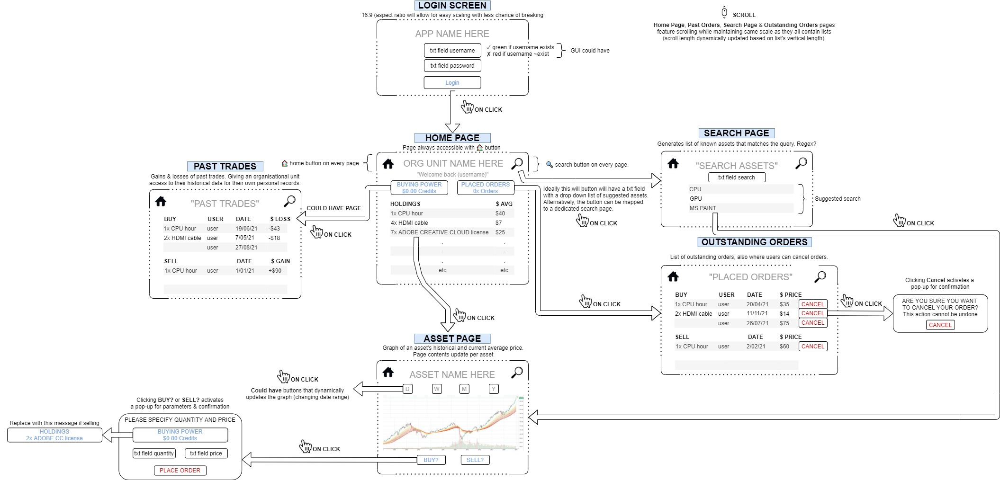

# Detailed Design Document
____
# SERVER SIDE

## Database
For this assignment a MariaDB database will be used to store six tables of data:
- [Users](#users-table)
- [OrgUnit](#orgunit-table)
- [Inventories](#inventories-table)
- [AssetInfo](#assetinfo-table)
- [BuyOrder](#buyorder-table)
- [SellOrder](#sellorder-table)

The relationships between these tables can be seen in the below ERD diagram.

The line types encode this information about the relations in the database:
- All relations are 1-M (a PK value may have arbitrarily many FK references)
- All relations are optional (a PK value may have 0 FK references),
  but all FK columns except for BoughtFrom and User.OrgUnit are `NOT NULL`

### Users Table
This table is used to store user data. It has four columns:
- Username (string, PK)
- Password (string)
- OrgUnit (string, FK referencing OrgUnit.OrgUnitName)
- AdminAccess (boolean)
- SaltString (string)

The password is stored as a hash, made using the salt string, so that plaintext
passwords are never sent between the client and server programs.
Ideally, the salt string would live in a separate table, but this
project's scope is too small for this to be worthwhile.

### OrgUnit Table
This table is used to store all the organisational units that use the app, and
their credit balance. It has two columns:
- OrgUnitName (string, PK)
- Credits (int)

### AssetInfo Table
This table is used to store the assets that can be traded in the application.
It has two columns:
- AssetID (int)
- AssetDesc (String)

### Inventories Table
This table stores information about the quantities of assets owned
by OrgUnits. Because "OrgUnit owns asset" is a logical many-many relationship,
this table will have a composite key: an organisational unit name, and an asset ID, may
each appear arbitrarily many times, but only one record may exist for any
given OrgUnit-Asset pair. The table has three columns:
- OrgUnit (string, partial key, FK referencing OrgUnit.OrgUnitName)
- AssetID (int, partial key, FK referencing AssetInfo.AssetID)
- Quantity (int)

### SellOrder Table
This table is used to track all the placed sell orders.
It has seven columns:
- OrderID (int, PK)
- Seller (string, FK referencing Users.Username)
- Asset (int, FK referencing Asset.AssetID)
- AskingPricePerAsset (int)
- CurrentQty (int)
- DatePlaced (date)
- DateResolved (date, will be null if order is currently outstanding)

### BuyOrder Table
This table is used to track all the placed buy orders.
It has eight columns:
- OrderID (int, PK)
- Buyer (string, FK referencing Users.Username)
- Asset (int, FK referencing Asset.AssetID)
- MaxPricePerAsset (int)
- RequestedQty (int)
- DatePlaced (date)
- DateResolved (date, will be null if order is currently outstanding)
- BoughtFrom (int, FK referencing SellOrder.OrderID)

The reason for this asymmetry is that the system will resolve matching
BuyOrders and SellOrders where the SellOrder has a higher quantity,
so it makes the most sense to model it like this.

## Public class ServerGUI
*Class desc:* Where the server-side program starts running.
Has a basic GUI for debug purposes

**Public void main()** 
*Method desc:* Initialises the server-side GUI

## Public Class NetworkServer
This class is the back end of the server side. It deals with information
sent over the connection and also automatically resolves trades every 5 minutes

**Private void handleConnection()**
*Method desc:* Handles protocol requests sent by NetworkDataSource
to execute queries using JDBCDataSource

**Private void ReconcileTrades()** 
*Method desc:* Search through the database and reconcile all outstanding trades

    -Save current datetime in a variable to use later
    -Go into the database
    -Use a query to get all outstanding sell offers
    -For each sell offer, oldest to newest:
       -Seek a buy offer where asset == this.asset, price >= this.price, quantity <= this.quantity
       -IF such an offer exists, do this process for it; if multiple are found prioritise the oldest
            -Write the saved datetime to the buy offer's DateResolved
            -Write the sell offer's ID to the buy offer's BoughtFrom
            -Reduce the sell offer's quantity by the buy offer's
            -IF the sell offer's quantity was reduced to 0, write the datetime to its DateResolved and move on immediately to the next sell offer
    -Leave the database
##Package-private class JDBCDataSource
This class is used by NetworkServer to handle the actual connection
to the MariaDB database

##Package-private class DBConnection
This class is used by JDBCDataSource to hold a static database connection

The structure might be simplified later

---
# PROTOCOL
The protocol connecting the two programs is the set of rules dictating the
communication between the server-side class NetworkServer and the
client-side class NetworkDataSource.

Communications will be sent using ObjectInputStreams and ObjectOutputStreams
working on sockets defined by the port number (stored on both ends)
and the host IP (stored on the client end).

All communications begin with the client sending a String (always one of its four public static final
string fields that it uses as keywords). It then sends a DataPacket object,
which was constructed thusly (all fields not mentioned in a given type are null):
- For a SELECT or DELETE query, the table field contains the relevant table name,
  and the filter field contains a string containing the desired query's WHERE clause
- For an UPDATE query,  the table field contains the relevant table name,
  and the object field contains the DataObject whose data should be written to the table
  if and only if a record with its primary key currently exists
- For an INSERT query, the table field contains the relevant table name,
  the object field contains the DataObject to insert, and the insertTypeFlag
  field is set to true if the query should be "INSERT UPDATE IF DUPLICATE KEY", false otherwise

The server receives these two transmissions, parses them, does the requested
database operation, and sends back one transmission. In the case of SELECT
queries, this will take the form of a HashTable with string or int keys depending on the table,
and the table's relevant DataObject subclass as the value type.
(Inventories queries will use our class InventoryKey for key type)
For other types of queries, the server will
send back an int value: the number of rows affected by the query.

---
# CLIENT SIDE

## Overall Functionality
This project will be composed of six main client side classes:
- [Main](#public-class-main---client-side)
- [Orders](#public-class-orders)
- [User](#public-class-user)
- [OrgUnit](#public-class-orgunit)
- [Assets](#public-class-asset)
- [GUI](#public-class-gui)

TODO: update to actually be right

The structure of the application is such that the Main class, which is used
to run the application, is dependent upon the Orders, Asset and GUI classes.
This implementation of the other classes has been deigned so that as much of
the applications' functionality can be abstracted from the top level of the
code as possible to keep in line with the principles of object orientated
programming. As such the key functionality of this application, buy/sell orders,
have been abstracted to the orders class which the main class is associated with.

The Orders class has been implemented to meet the requirements for placing trades.
This is a relatively simple class with the sole purpose of processing the trades
placed by the user and adding them to the database. In order to do this, this class
is dependant upon both the Asset class, and the User class.

The user class has been used to implement the requirements for individual users as stated
in the requirements document. Furthermore, this class also has two subclasses used to
differentiate between common users and administrators. Due to the fact that users are required
to be a part of an organisational unit this class is dependant upon the OrgUnit class being implemented.

The OrgUnit class is used to interact between the main application, and the database
for organisation specific information such as the organisations number of credits,
asset types and quantity. The UML diagram below shows that this class is only dependant
upon the Asset class due to various function in the class using the Asset class as a variable type.

The asset class is used as a means to interact with the database for asset specific information
such as historical trade data and current average price. This class is also used as a means for
interacting with the database for all assets.

The figure below shows the UML diagram for the application.

## Public class Main - Client Side
*Class desc:* Where the client-side program starts running from.

**Public static void main()** 
*Method desc:* Where the user will log in. User's will have to input the
correct username and password. Exceptions will be thrown if the login details are
incorrect/invalid. If successful, the method will check if the user is part of the
IT Admin team or a general user. If the user is part of the IT Admin team, they will
have access to a series of authorised methods. If they are a general user, the method
will check if they are part of an organisational unit. If they are, they will have
access to a series of trading methods. If they are not, an exception will be thrown
asking the user to contact their IT Administrator to join an organisational unit 
*@throws* Exception if username not found 
*@throws* Exception if password does not match username 
*@throws* Exception if user is not part of an organisation/IT Admin team 

    - While loop (while not logged in)
    - Request username through input
    - Checks login details HashMap collection from the database 
      (reminder: username is the key)
    - IF username does not exist throw an exception
    - IF username exists in the database temporarily store the username  
      and request the password through input
    - Request password input
    - IF password does not match username throw an exception,
      clear temporarily stored username and loop back
    - IF password matches username check the access level
    - IF the access level is User, check if the user is part of an organisational unit
    - IF the user is not part of any organisational unit throw an exception
      ("contact your IT Administrator to join an organisational unit)
    - IF the access level is Admin, list the Admin interface methods

**public boolean login(String usernameInput, String passwordInput)** 
*Method desc:* Method used to log the user into the application. The function
takes the entered username and password and compares them to the records in the database. 
*@throws* DoesNotExist  
*@throws* IllegalString

    - Check that the username exist and grab the SALT string
    - Hash the password with the SALT
    - Confirm that the password matches the database records for the account.

## Public class Orders
*Attributes:*  

        - String tradeID
        - OrgUnit / User

**Public void buyOrder(asset, quantity, price)** 
*Method desc:* Method user calls to place a buy order. Method extends a general
ORDER method, using polymorphism to automatically store the trade info in a
specific database (if this method is called, trade info will be stored in a
BUY data section which is ultimately part of the outstanding trade data).
This will separate BUY/SELL trades so matching and executing trades can be
done with ease. The user must specify the asset and quantity they are requesting
to BUY along with the price they're willing to pay for. 
*@throws* Exception if the asset does not exist in the system 
*@throws* Exception if the organisational unit does not enough available credits 
*@throws* Exception if the offer price is out of bounds  

    - Check whether the asset type exists (does not mean if the asset is currently 
      being sold, instead making sure the asset type has been added to 
      the system by an IT Administrator).
    - IF the asset does not exist, throw an exception.
    - IF the asset exists, temporarily store the asset type for the order.
    - Temporarily store the quantity for the order.
    - Check wheteher the price is within the bounds.
    - IF the asking price is out of bounds throw an exception.
    - IF the asking price is within bounds, temporarily store the price.
    - Check whether the organisational unit's available funds >= price they 
      are willing to pay.
    - IF the price is larger than the amount of available credits, throw an exception.
    - IF the price is less than or equal to the available credits, temporarily 
      store the price for the order.
    - IF the above checks out, send this information into the database, the database
      should generate a unique trade ID (to keep other methods in the system functional)
    - Decrease the organisational unit's available credits with the credits they offered
      in the BUY order (this will be added back if the trade is canceled before execution).
    - Print a message to alert the user the trade offer has been submitted.

**Public void sellOrder(asset, quantity, price)** 
*Method desc:* Method user calls to place an order. Method extends a general
ORDER method, using polymorphism to automatically store the trade info in a
specific database (if this method is called, trade info will be stored in a
SELL data section which is ultimately part of the outstanding trade data).
This will separate BUY/SELL trades so matching and executing trades can be
done with ease. The user must specify the asset and quantity they are requesting
to BUY along with the price they're willing to pay for. 
*@throws* Exception if the asset does not exist in the system 
*@throws* Exception if the organisational unit does not have the asset 
*@throws* Exception if the organisational unit does not have enough (quantity) of the asset 
*@throws* Exception if the asking price is out of bounds 

    - Check whether the asset type exists (does not mean if the asset is currently 
      being sold selling, instead making sure the asset type has been added to 
      the system by an IT Administrator).
    - IF the asset does not exist, throw an exception.
    - IF the asset exists, check if the organisational unit has this asset
      (quantity at least >1).
    - IF the organisational unit has the asset, check if the quantity is <= quantity
      user wants to sell.
    - IF the sell quantity is greater than the available quantity throw an exception.
    - IF the available quantity is less than or equal to the quantity the user wants 
      to sell, temporarily store the asset type for the order.
    - Temporarily store the quantity for the order.
    - Check if the asking price is in bounds (greater than zero)
    - IF the asking price is out of bounds throw an exception.
    - IF the asking price is within bounds, temporarily store the price.
    - IF the above checks out, send this information into the database, the database
      should generate a unique trade ID (to keep other methods in the system functional)
    - Decrease the organisational unit's quantity of the asset they listed to sell in 
      the SELL order (this will be added back if the trade is canceled before execution).
    - Print a message to alert the user the trade offer has been submitted.

**Public void cancelOrder(tradeID)** 
*Method desc:* Method user calls if they want to cancel an outstanding order.
User should first use the viewOrders method to see all outstanding orders along
with their unique trade ID. From here, the user passes the unique trade into
the method, where the method will then delete all temporary data for that trade
and return the quantity or credits back (depending on if the outstanding trade was
listed as BUY or SELL). 
*@param* Integer for the trade ID to cancel the correct and specific trade 
*@throws* Exception if the trade ID does not exist 

    - Match the quiried trade ID with the one in the outstanding order database.
    - IF the trade ID is not found throw an exception.
    - IF there is a match, ask the user if they are sure they want to cancel the trade.
    - IF the user responds with "No", break from the method.
    - IF the user responds with "Yes", delete the outstanding trade info and return the 
      asset quantity or credits (depending if BUY or SELL trade).

**Public void viewOrders()** 
*Method desc:* To view current outstanding orders before they are executed, the
user calls this method with no parameters. The method will check the database for
the outstanding orders (temporary data). All temporary orders linked to the organisation
will be retrieved and stored in an array list (possible to sort via date but not required).
From here, the method will loop through the data printing each outstanding order (date/time,
quantity, price, type of BUY/SELL, trade ID). 
*@throws* Exception if no outstanding orders are found 

    - Quiries the temporary outstanding trade data for outstanding
      trades linked to the organisational unit.
    - If the organisational unit has no outstanding trades, simply
      throw an exception.
    - If at least 1 outstanding trade is found, store it in an 
      array list (possibly sorting) and using a loop, print each 
      trade out (date/time, quantity, price, type of BUY/SELL, trade ID).

**public void placeSellOrder(Asset assetName, int qty, int price)** 
*Method desc:*  
*@throws* OrderException
*@throws* DoesNotExist

    - Create new order (instance)
    - Place a sell order with the instance
    - The complexity lies in the order class' methods

**public void placeBuyOrder(Asset assetName, int qty, int price)** 
*Method desc:* Method used to place a buy order. 
*@throws* OrderException
*@throws* DoesNotExist

    - Create new order (instance)
    - Place a buy order with the instance
    - The complexity lies in the order class' methods

**public void cancelOrder(String orderID)** 
*Method desc:* Method used to cancel a specified order and remove it from the list of
unconsolidated orders. The user will select the specified order from a displayed list
of unconsolidated orders. The selected order will then parse this function the relevant
order ID. 

    - Create a new order (instance)
    - Call the cancel order method 
    - (will cancel if order has not executed yet & found using order id)
    - The complexity lies in the order class' methods

**public HashMap<Asset, Integer> getAssets(String OrgUnitID)** 
*Method desc:* Method used to get a list of assets that an organisation has in their
inventory. 
*@throws* DoesNotExist

    - Check that the user is a part of an orgnisational unit
    - Get a list of assets for the users OrgUnit from the databses Inventory table
    - Get a list of associated quantites from the Inventory table
    - Return a hash map of the assets and their associated quantities

**public int getCredits()** 
*Method desc:* Method used to get the credit balance for the users associated Organisation 
*@throws* DoesNotExist

    - Check that the user is a part of an orgnisational unit
    - Returns the credit balance of the organisational unit

**public Boolean changePasswordAdmin(String username, String newPassword)** 
*Method desc:* Method used by administrators to update a users passwords. 
*@throws* DoesNotExist  
*@throws* NotAuthorised  
*@throws* IllegalString

    - Check that the specified user exists
    - Check that the current user is an admin and has access to use this function
    - Check that the new password meets the conditions
    - Get the admin to enter the pasword twice to ensure that the user knows thier
      password and hasn't made any mistakes
    - Update the user's password in the database

**public boolean changeAccess(String username, boolean newAccess)** 
*Method desc:* Method used by administrators to change any users' admin access level. 
*@throws* DoesNotExist Exception  
*@throws* NotAuthorised Exception

    - Check that the current user is an admin
    - Check that the user exists
    - Call server-side to update the database

**public boolean newUser(String username, String password, boolean adminAccess)** 
*Method desc:* Method used by administrators to add new users to the application. 
*@throws* AlreadyExists Exception  
*@throws* NotAuthorised Exception  
*@throws* IllegalString Exception

    - Check that the current user is an admin
    - Create a new User object
    - Call server-side to append the new User's data to the database's User Table

**public boolean newUnit(String unitName)**  
*Method desc:* Method used by administrators to add new units to the application. 
*@throws* NotAuthorised  
*@throws* AlreadyExists

    - Check that the current user is an admin
    - Create a new Unit object
    - Call server-side to append the new Unit's data to the database's Unit Table

**public boolean newAsset(String assetName)** 
*Method desc:* Method used by administrators to add new assets to the application. 
*@throws* NotAuthorised  
*@throws* AlreadyExists

    - Check that the current user is an admin
    - Create a new Asset object
    - Call server-side to append the new Asset's data to the database's Asset Table

**public boolean deleteUser(String username)** 
*Method desc:* Method used by administrators to remove users from the application. 
*@throws* NotAuthorised  
*@throws* DoesNotExist

    - Check that the current user is an admin
    - Check that the user exists
    - Call server-side to delete the User's data from the User Table

**public boolean deleteUnit(String unitName)** 
*Method desc:* Method used by administrators to create a new asset. 
*@throws* NotAuthorised  
*@throws* DoesNotExist

    - Check that the current user is an admin
    - Check that the unit exists
    - Call server-side to delete the Unit's data from the Unit Table

**public boolean deleteAsset(String assetName)** 
*Method desc:* Method used by administrators to create a new asset. 
*@throws* NotAuthorised  
*@throws* DoesNotExist

    - Check that the current user is an admin
    - Check that the asset exists
    - Call server-side to delete the Asset's data from the Asset Table

**public boolean addUserToUnit(String username, String unitName)** 
*Method desc:* Method used by administrators to add a user to a unit. This is a polymorphic
implementation of the changeAccess method above using method overloading of parameters. 
*@throws* AlreadyExists  
*@throws* DoesNotExist  
*@throws* NotAuthorised

    - Call server-side to get the user object using the username
    - Check that the user is not part of any unit yet (null)
    - Assign the unit to the user's data
    - Call the server-side to update the database

**public boolean addUserToUnit(String[] usernames, String unitName)** 
*Method desc:* Method used by administrators to add multiple users' to a unit. This is a polymorphic
implementation of the changeAccess method above using method overloading of parameters. 
*@throws* AlreadyExists  
*@throws* DoesNotExist  
*@throws* NotAuthorised

    - Same functionality as the previous function except it is looped over a list of users

**public boolean removeUserFromUnit(String username, String unitName)** 
*Method desc:* Method used by administrators to remove a user from a unit.  
*@throws* AlreadyExists  
*@throws* DoesNotExist  
*@throws* NotAuthorised

    - Same functionality as the previous function except it is looped over a list of users

**public void addAsset(String unitName, Asset assetName, int qty)** 
*Method desc:* Method used by administrators to add an asset to an Organisations inventory. This is primarily
an initialisation function used to define the starting assets of an organisation.  
*@throws* NotAuthorised  
*@throws* DoesNotExist  
*@throws* AlreadyExists

    - Check that the current user is an admin
    - Check that the specified OrgUnit exists
    - Check that the asset exists in the database Asset table
    - If both the OrgUnit and Asset exist append thegiven quantity of the asset to the OrgUnits Inventory
    - Update the OrgUnits Inventory in the database

**public void removeAsset(String unitName, Asset assetName)** 
*Method desc:* Method used by administrators to remove an asset from the database & all connected units. 
*@throws* NotAuthorised  
*@throws* DoesNotExist

    - Check that the current user is an admin
    - Check that the OrgUnit exists
    - Check that the Asset Exists
    - Remove the Asset from the Asset table in the DataBase

**public void setAssetQuantity(String unitName, Asset assetName, int amount)** 
*Method desc:* Method used by administrators as an initialisation function to set the
quantity of an asset that an organisation has when they are first created.  
*@throws* NotAuthorised  
*@throws* DoesNotExist

    - Check that the current usr is an admin
    - Check that the OrgUnit exists 
    - Check that the Asset exists
    - Set the asset quantity to the specified amount and update the database

**public void adjustAssetQuantity(String unitName, Asset assetName, int amount)** 
*Method desc:* Method used by administrators to increase/decrease the amount of an asset that an organisation has. 
*@throws* NotAuthorised  
*@throws* DoesNotExist

    - Check that the OrgUnit exists
    - Check that the Asset exists
    - If the amount is a positive int or zero add is to the current quantity the OrgUnit has of the asset
    - If the amount is a negative int subtract it from the current quantity the OrgUnit has of the asset

**public void setBalance(String unitName, int amount)** 
*Method desc:* Method used by administrators as an initialisation function used to set an
organisations credit balance when they are first created. 
*@throws* NotAuthorised  
*@throws* DoesNotExist  
*@throws* InvalidAmount

    - Check that the current user is an admin
    - Check that the OrgUnit exists
    - Check that the amount of credits to set the balance at is a number
    - Check that the amount of credits to set the balance at isn't a negative number
    - Set the OrgUnit's balance to the specified amount
    - Update the database OrgUnit table to reflect the OrgUnits new balance

**public void adjustBalance(String unitName, int amount)** 
*Method desc:* Method used by administrators to increase/decrease the balance that an organisation has.
This method is called when consolidating orders to adjust an organisations credit balance to reflect
their orders.  
*@throws* NotAuthorised  
*@throws* DoesNotExist  
*@throws* InvalidAmount

    - Check that the OrgUnit exists
    - Check that the amount of credits to deduct from the OrgUnits balance
      does not esceed the current balance
    - If the amount variable is a positive int or zero add it to the current balance 
    - If the amount variable is a nevative int deduct it from the current balance

## Public class User
*Attributes:* <b />

    - private final String username;
    - private final String salt;
    - private String hashedPassword;
    - private Boolean adminAccess;
    - private OrgUnit unit;

**public User(String username, String password, Boolean adminAccess)** 
*Method desc:* User Constructor. Creates a new user object with a unique username,
a hashed password and access level. The constructor will check that the username
does not contain white spaces & is an alpha string only. It calls upon 2 other methods
to create a unique globally salt string that is needed for hashing the password.
By default, the user will not be part of any organisational unit.  
*@throws* IllegalString  

    - If username does not contain white-spaces, numbers or special chars, convert to lowercase.
    - If username is not made up of purely alphabetic chars, throw exception.
    - Set the username & admin access bool.
    - Call the salt string method to generate a one-time unique salt string for the user.
    - Call the secure password method to hash the given password with the salt string.

**public String getUsername()** 
*Method desc:* Getter function for the Users username. 

    - Returns the users username
    - This will be a very simple helper function

**public String getSalt()** 
*Method desc:* Getter function for the SALT string. The SALT string is used to
encrypt/hash the password. 

    - Returns the SALT string
    - This will be a very simple helper function

**public String getPassword()** 
*Method desc:* Getter function for the encrypted/hashed password. 

    - Returns the hashed password
    - This will be a very simple helper function

**Public void setPassword(String hashedPassword)** 
*Method desc:* Setter function for the encrypted/hashed password. When users change their passwords / an admin changes a user's password, this method will be called to update it locally & in the DB.  

    - Sets the user's password
    - Will be a simple helper function
    - Will call a server-side method to update the DB

**public boolean getAdminAccess()** 
*Method desc:* Getter function for the access level of the user. 

    - Returns TRUE if the user is an admin
    - Returns FALSE if theuser is not an admin
    - This will be a very simple helper function

**public void setAdminAccess(boolean newAccess)** 
*Method desc:* Setter function for a user's admin access. TRUE if they are an admin, FALSE if otherwise. Called when an admin uses the changeAccess() method.  

    - Sets the user's access level
    - Will be a simple helper function
    - Will call a server-side method to update the DB

**public OrgUnit getUnit()** 
*Method desc:* Getter function for the Organisation that the user is a part of. 

    - Returns the OrgUnit that the user is a part of.
    - This will be a very simple helper function

**public void setUnit(String unit)** 
*MethodDesc:* Setter function for the users' organisation. An admin will pass a known
OrgUnit object to this function which will then be stored as part of the user's data. 

    - Sets the users OrgUnit
    - Will be a simple helper function
    - Will call a server-side method to update the DB

**public String generateSaltString(String username)** 
*Method desc:* Method used to create the SALT string. The SALT string is a string of
10 random characters used to hash the users' password before sending over the network 

    - Generate a string of 10 random characters
    - Append the username to the end of the SALT sting to make it globally unique
    - Return the SALT string

**public String hashPassword(String password, String salt)** 
*Method desc:* Method used to hash the password before sending it over the network to store
it in the database. 
*@throws* IllegalString  

    - Check that the password meets the conditions
    - Convert both the user's unique SALT string, and password to seperate byte arrays
    - Sum the two byte arrays together
    - Convert the sum of the bytes to a string
    - Return the resulting string

**public boolean changePasswordUser(String newPassword)** 
*Method desc:* Method used by any user (admin or not) to update their password. 
*@throws* IllegalString

    - Check that the new password meets the conditions
    - Get the user to enter the pasword twice to ensure that the user knows thier
      password and hasn't made any mistakes
    - Update the user's password in the database

## Public class OrgUnit
*Class desc:* Used to interact with the database for Organisation specific data.

**Public int viewAssetQuantity(String queriedAsset)**  
*Method desc:* To view quantity of an organisational unit's asset. The user
calls method with the asset name, the method will check that organisation's
assets for the queried asset. If the asset is found, method will finally print
the quantity. 
*@param* String for the name of the queried asset 
*@throws* Exception if the asset is not found (does not exist) 

    - Quiries the user's organisational unit's collection of assets 
      (reminder: a collection with no duplicates)
      (collection will be asset objects with a name & type)
    - IF the asset is found, print the quantity as a string
    - IF the asset is NOT found, throw an exception

**void modifyAsset(asset, amount)** 
*Method desc:* Method used by IT admins to change the amount of a specified
asset within an organisational unit. This can be used to make corrections to
asset amounts when an error has occurred. All BUY/SELL orders within the unit
made with this asset type will be during this method. IT admins may want to
give appropriate notice of this change to prevent any issues. 
**(NOTE: is there a better way to modify the assets without cancelling orders?)**  
*@throws* Exception if the organisational unit does not exist  
*@throws* Exception if the asset does not exist in the system  
*@throws* Exception the amount is out of bounds  

    - Check if organisational unit exists.
    - IF organisational unit does not exist, throw exception.
    - IF organisational unit does exist, check if asset exists.
    - IF asset does not exist, throw exception.
    - IF asset does exist, check if amount is out of bounds.
    - IF amount < 0, throw exception.
    - IF amount >= 0, use a loop with cancelOrder() to cancel all orders
      containing the specified asset.
    - Overide asset amount for organisational unit.

**void addAssets(assetName, amount)**  
*Method desc:* Method used by IT admins to create a new asset type. The
method will check if the asset type exists in the systems already, before
adding it to the database.  
*@throws* Exception if asset type already exists.  

    - Using a loop, check if asset type exists in the system already.
    - IF the asset type exists, throw exception.
    - IF the asset type does not exist, add the new asset to the database.

**void modifyCredits(orgUnit, amount)**  
*Method desc:* Method used by IT admins to change the amount of credits an
organisational unit has. This can be used to make corrections to credit amounts
when an error has occurred, or to add/subtract credits for other reasons.
All BUY/SELL orders within the unit will be during this method. IT admins
may want to give appropriate notice of this change to prevent any issues.  
**(NOTE: is there a better way to modify credits without cancelling orders?)**  
*@throws* Exception if the organisational unit does not exist  
*@throws* Exception the amount is out of bounds  

    - Check if organisational unit exists.
    - IF organisational unit does not exist, throw exception.
    - IF organisational unit does exist, check if amount is out of bounds.
    - IF amount < 0, throw exception.
    - IF amount >= 0, use a loop with cancelOrder() to cancel all orders
      within the unit.
    - Overide credit amount for organisational unit.

**Public int viewAvailableCredits()**  
*Method desc:* To view available credits of an organisational unit. The user
calls this method with no parameters. The method will print the available credits. 
*@returns* Integer for the amount of available credits 

    - Quiries the user's organisational unit's current available credits
    - Prints the available credits for that unit as a string

## Public class Asset
*Attributes:* <b />

    - private int assetID
    - private String assetDesc
    - public static TreeMap<LocalDate, ArrayList<Integer>> priceHistory (acting database)

**Public Asset(int assetID, string description)**  
*Constructor desc:* This constructor creates a new Asset object with a
unique asset ID and custom description, both of which are entered by an IT
admin.

**Public String getAssetDesc()**  
*Method desc:* This method returns the asset's description as a string.

**Public int getAssetID()**  
*Method desc:* This method returns the asset's ID number as an int.

**Public void addHistoricalPrice(int price, LocalDate date)**  
*Method desc:* This method will be called every time a trade, involving this
asset, is completed. It stores the prices into the database at the current
date, using LocalDate.now(), allowing other methods to use this data for averaging or trade history.

    - Creates ArrayList<Integer> prices.
    - IF the database does not contain todays date, create it.
    - ELSE find the location of current date in database.
    - Add price to database at current date.

**Public static List getDatesBetween(LocalDate startDate, LocalDate endDate)**  
*Method desc:* Method used within getAveragePrice to create a List that
contains all the dates between startDate and endDate.

**Public int getAveragePrice(LocalDate startDate, LocalDate endDate)**  
*Method desc:* This method finds the average price of completed trades,
involving the asset, between dates specified by the user. The method calls
getDatesBetween to get a list of all the dates required. It then counts and
sums all the prices at each date before calculating the average.

    - Call getDatesBetween to get all dates between startDate and endDate.
    - Initialise int sum and int count to zero.
    - FOR each date, 
      - IF the date is found within the database,
        - Count and sum all prices.
        - Calculate average price (sum/count).

**Public TreeMap<LocalDate, Integer> getHistoricalPrices(long timeInterval)**  
*Method desc:* This method takes a time interval such as days, weeks, months,
years, etc. It the finds averages for this interval from the earliest date
within the database, and returns them as a TreeMap. For example, if a time
interval of weeks was specified, the method would find the average price for
every week over the entire database. This data can be used to create a
graphical plot of price history against time.

    - Create TreeMap<LocalDate, Integer> averages.
    - Determine current date with LocalDate.now().
    - Set startDate and endDate for specified interval.
    - Find dates between first and last entry of database.
    - Determine the number of intervals in the database.
    - FOR number of intervals, 
      - Call getAveragePrice for their specific startDate and endDate.
      - Update startDate and endDate for next interval.

## Public class GUI

*Class desc:* Used to produce the GUI for the application

