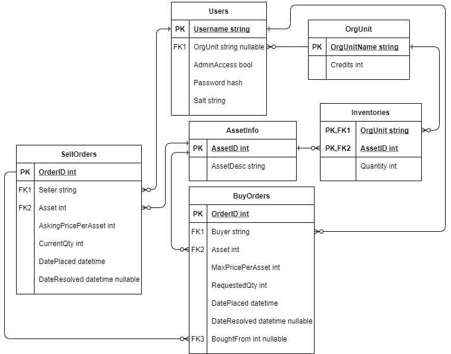

# Requirements
This project should consist of two programs that can be built and run separately.

----
## Server-side core functionality
Requirements that apply to the server-side program

| Requirement                 | Descriptions         | Priority   |
| :---                        | :---                 | :---:      |
| Store user information      | System stores user information: unique username, password, account type, organisational unit membership | Must have |
| Store organisational unit info | System stores information on organisational units: name, credit balance  | Must have |
| Store asset info | System stores information on asset types | Must have |
| Store inventories | System stores information on the assets held by each organisational unit | Must have |
| Store outstanding trade info | System stores information on buy and sell orders: who placed it, asset, quantity, price, date placed | Must have  |
| Store executed trade info | System stores all of the above information for resolved buy and sell orders, plus date resolved and information on which buy-sell pairs formed transactions | Must have  |
| Process client requests | Server program listens for client program requests to retrieve or modify data and sends back appropriate results | Must have | 
| Automatic trade resolution | System frequently checks to match BUY/SELL orders | Must have  |
| BUY/SELL restrictions | System only resolves trades where buy quantity <= sell quantity and buy price >= sell price | Must have  |
| Executing trades | When trades are resolved, the credits and holdings of the organisational units involved are correctly updated, using the buy quantity and the sell price | Must have |
| continued | If a transaction does not reduce a sell order's quantity to 0, the order will remain outstanding. If the prices were different, the difference will be returned to the buyer | Must have |
| Network connection | Communication between the server and client programs happens via a network socket | Should have |
| Database | System stores information in a SQL Database which persists between sessions | Should have |
| Read config file | System reads config file to get port number | Could have |

Note that the "should have" requirements almost qualify for "must have". However, most of the absolute must-haves can
be imitated by a system that does not utilise a real database or network connection. A mock database structure,
implemented early on to stand in for the server connection, remains present even in the final program to allow the client program
to be tested without having the server active, and the client program can be configured to use it.

These requirements have guided the development of a MariaDB database with tables and relations described by the following
Entity Relationship Diagram.

Every five minutes, the server program will automatically run some queries to determine if any trade resolution is necessary,
and resolve the trades if so. Older buy and sell orders will be prioritised over newer ones.

## Client-side core functionality
Requirements that are needed for the Client-side to be functional.

###Program components
| Requirement               | Description                                                   | Priority   |
| :---                      | :---                                                          | :---:      |
| Order placing checks | The total price of a buy order, and quantity of a sell order, shouldn't be allowed to exceed the unit's available credits/holding of the asset | Must have |
| Password hashing
| Graphical User Interface  | A more user friendly UI instead of the terminal               | Could have |
| Generate visual graph     | A (stock-like) graph showing an asset's value fluctuating     | Could have |
| Trade executed alert      | Push an alert to online members of that organisational unit   | Could have |
| Client to read config file| Changes the Client's server IP address and port to connect to   |     Could have|

These requirements will be enforced on the client side of the client-server communication

###Admin abilities

| Requirement               | Description                                                   | Priority   |
| :---                      | :---                                                          | :---:      |
| Create usernames           | As an IT admin I want to create unique usernames                 | Must have  |
| Generate passwords         | As an IT admin I want to generate passwords for users            | Must have  |
| Assign account type        | As an IT admin I want to specify each account's level of access  | Must have  |
| Assign user to unit        | As an IT admin I want to assign users to a unit                  | Must have  |
| Credit system              | As an IT admin I want to edit the budget assigned to a unit       | Must have  |
| Create new asset types     | As an IT admin I want to add any asset type                      | Must have  |    
| Edit assets     | As an IT admin I want to edit asset descriptions               | Should have  |    
| Create organisational unit | As an IT admin I want to create new organisational units  | Must have  |
| Edit inventories | As an IT admin I want to modify the asset quantities held by units  | Must have  |

###User abilities

| Requirement               | Description                                                   | Priority   |
| :---                      | :---                                                          | :---:      |
| Set SELL order            | As a user I want to sell assets by setting quantity & price   | Must have  |
| Set BUY order             | As a user I want to buy assets by setting quantity & price    | Must have  |
| Cancel an order           | As a user I want to cancel outstanding orders from my unit    | Must have  |
| Request current orders    | As a user I want to view my unit's outstanding orders         | Must have  |
| Request available inventory| As a user I want to view my unit's asset holdings      | Must have  |
| Request available credits | As a user I want to view my unit's available credits          | Must have  |
| Request average BUY/SELL  | As a user I want to view an asset's current average price     | Should have|
| Password Self Service     | As a user I want to be able to change my own passwords        | Should have |

----

## GUI Requirements
- Users to receive a message upon fulfilment of an order.
- Current orders graph 

- Historical trades Graph

## Additional Documentation
### Configuration File
The configuration file for the application is to contain the IP address and Port Number of the server that the application is hosted on.
Additionally, the configuration file for the Server is to also contain these details.
