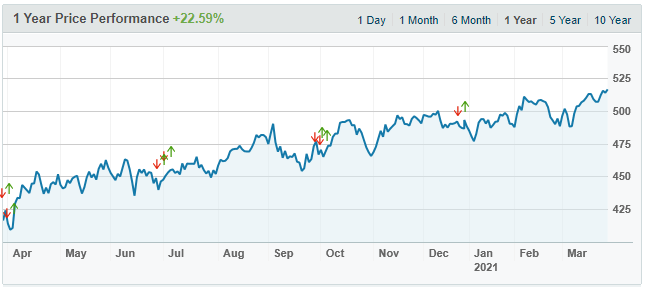

# Client Requirements 

## Server-side core functionality
Only the IT Administration team is authorised to add/edit the requirements in the table below.
The data must all be stored in the server-side database.

| Requirement               | Description                                     | Priority      |
| :---                      | :---                                            | :---:         |
| Create usernames          | Per user: a UNIQUE username                     |      Must have|
| Generate passwords        | Per user: an initial password                   |      Must have|
| Assign account type       | Per user: level of access (IT admin v user)     |      Must have|
| Assign user to unit       | Per user: access to a unit's resources & credits|      Must have|
| Credit system             | A mini internal economy & a new currency        |      Must have|
| Create new asset types    | Ability to create any asset type (universal)    |      Must have|       
| Create organisational unit| Assign name & budget, relevant assets & quantity|      Must have|
| Store trade info (temporary)| BUY/SELL, unit, asset, quantity, price, date    |      Must have|
| Store trade history       | Identical data to the above                     |      Must have|

Briefly recapping the server-side core functionality table above.
- For each user we must have this core information, so their account is unique, secure and functional.
- The true range of asset types will not be known in advanced, therefore the system needs to be flexible for any future assets.
- Organisational units are like special accounts that hold the sensitive information (current budget, current assets, quantity etc).
  This information can be ACCESSED by users assigned to the unit (changing the values through BUY/SELL trades).
  Only the IT Administration team can directly alter this sensitive information.
- Storing the current trade info is crucial to match and execute BUY/SELL orders.
  This info also allows the current asset quantity to decrease, so the unit does not oversell.
  This info also allows us to get the CURRENT average BUY/SELL prices so that unit's looking to trade can make a better judgement.
  The reason this info is temporary is because the current price is always fluctuating. 
  Also users can always cancel a trade before execution and all that info shouldn't be stored.
- Storing the trade history for the long-term is best practice so if anything goes wrong we can find out where and when.
  This info also allows us to generate graphs of an asset's historical trade value.

## Client-side core functionality
Requirements that are needed for the Client-side to be functional.

| Requirement               | Description                                     | Priority      |
| :---                      | :---                                            | :---:         |
| Set SELL order            | Per asset: set quantity and price               |      Must have|
| Set BUY order             | Per asset: set quantity and price               |      Must have|
| Cancel an order           | See your unit's current orders and cancel them  |      Must have|
| BUY/SELL restrictions     | Quantities match & BUY price >= SELL price      |      Must have|
| Frequent checks           | Client frequently tries to match a BUY/SELL if requirements are met               |   Must have|
| Executing trades          | Execute at the SELL price. Decrease credits & increase quantity, store trade info |      Must have|
| Request current orders    | Before the GUI, request to see the unit's orders|      Must have|
| Request average BUY/SELL  | Before the GUI, request to see average prices   |      Must have|
| Request avaliable quantity| Before the GUI, request to see quantity         |      Must have|
| Request avaliable credits | Before the GUI, request to see credits          |      Must have|

Briefly recapping the client-side core functionality table above.
- To successful set a SELL order, avaliable quantity >= trade quantity.
  Temporarily decrease that asset's quantity.
- To successful set a BUY order, avaliable credits >= trade credit.
  Temporarily decrease that unit's credits.
- IF the trade hasn't executed, allow users to cancel the trade.
  This deletes all trade info that was stored temporarily and increases 
- For the restrictions, no unit will pay more or sell for less than they specified.
  As long as the BUY price is higher than the asset's SELL price AND quantities match,
  Then the trade can be executed at the LOWEST price (aka the SELL price).
- Frequent checks are made by the client in an attempt to match BUY/SELL orders and execute.
- The GUI is a could have as stated it would "be nice to have" but the system can be completely functional without it.
  This means that users should be able to request the average BUY/SELL prices, their avaliable assets' quantities and credits from the command line.

## Functionality
The application must have the following items implemented for basic functionality:
- Organisational Units
- Credits
- Orders
- Assets
- Individual Users

For extended functionality the application should have:
- GUI
- Current offers for a given asset (Buy/Sell Price, QTY)
- Historical Trades graph

The application and associated Databases are to be stored on a singular Client-Server. 
The server is to contain two (2) Databases, User Information, and Organisational Unit Information, to store the application's information.
The databases are to be in one of the following database formats:
- MariaDB
- PostgreSQL
- SQLite3

The **User Information** database is to store the following Individual User information:
- Username
- Password
- Account Type (User/Administrator)
- Organisational Unit

The **Organisational Unit Information** database is to store the following Organisation Information:
- Organisation Name
- Number of Credits 
- Assets
- Quantity of Individual Assets
- Current Trades
    - Trade Type (Buy/Sell)
    - 2nd Party Information (Organisation Name)
    - Asset
    - Quantity 
    - Price
    - Date

## Organisational units
Organisational Units are equivalent to departments or companies and must have the following feature:

- Credit Balance
- Assets
- Individual Asset Quantities
- Orders

## Credits
Credits are used as a common currency between Organisational Units.
The quantity of credits should be stored per individual Organisational Unit.

***Assumption:*** Credits should be a whole number, no decimal places, to allow for easy storing and manipulation. Client & user feedback on how credits are used should be used to form this data type.

## Assets
Assets are the items that are traded between Organisations.
There is no limit to the number of Assets that an Organisation can have or the quantity of a given asset.

## Orders
Orders are used to track the trades between organisation units. There is no limit to the number of orders that can be listed by either a user or organisation. 
There are to be two (2) types of orders, Buy orders & Sell orders. 

**Buy Orders** are a request from one organisation to another to *Buy* a *Quantity* of an *Asset* for a certain number of *Credits*

**Sell Orders** are a request from one organisation to another to *Sell* a *Quantity* of an *Asset* for a certain number of *Credits*

The system will periodically check for outstanding trades (buy and sell offers concerning the same asset). The system will attempt to reconcile these trades.
For this to succeed, the sell price must be equal to or lower than the buy price, and there must be enough assets for sale to satisfy the buy order. If the buy price is lower than the sell price, nothing will happen.

If the quantities match, both orders will be automatically removed when the trade is reconciles.
If the sell order is offering a greater number of the asset than the buy order is requesting, the sell order will not be removed but instead have its quantity reduced.  

If a buy order exceeds the total credits of the buyer's organisational unit, or a sell order exceeds the quantity of that asset possessed by the seller, the system must ***not*** process the order and should give some feedback to the user to explain why the order was not processed.

### Orders - Nice to Haves
Users should be able to view a list of current orders that have not yet been processed. Using this list users should be able to cancel an order. 

A graph showing the historical trading data for the given asset. The graph should contain the following items:
- X Axis - Date & Time
- Y Axis - Price

Current offers including:
- Buy/Sell price
- Quantity

## Individual Users
Individual users are the personnel that will be placing & requesting the trades. There is to be no limit to the number of users. Users will need to be able to complete the following functions:
- Placing Buy/Sell Orders
- View current organisational orders
- Cancelling orders
- View current offers for a given asset
- View historical trading information for a given asset

Each user will be part of an Organisational Unit. There can be no users without an associated Organisational Unit.
Users will inherit their organisations credits. As such, the cost of trades will be subtracted from the organisations total, and  the profit from sales will be added to the organisations total.

Each user will have their own unique username and password. Users should be allowed to change their own passwords without external assistance. 

### Administrators
There should also be a second user type for administrators.
Administrators are to have the ability to:
- Edit the number of credits that an organisation has (Confirm if this is any or if it is only their specific organisation)
- Edit the Quantity of a given asset that an organisation has
- Add a new asset to an organisation
- Add new users
    - Assign Usernames & Passwords
    - Assign Organisational Units to Users
- Create new Administrator Users with the same level of access

## GUI Requirements
- Users to receive a message upon fulfilment of an order.
- Current orders graph 

- Historical trades Graph

## Additional Documentation
### Configuration File
The configuration file for the application is to contain the IP address and Port Number of the server that the application is hosted on.
Additionally, the configuration file for the Server is to also contain these details.
